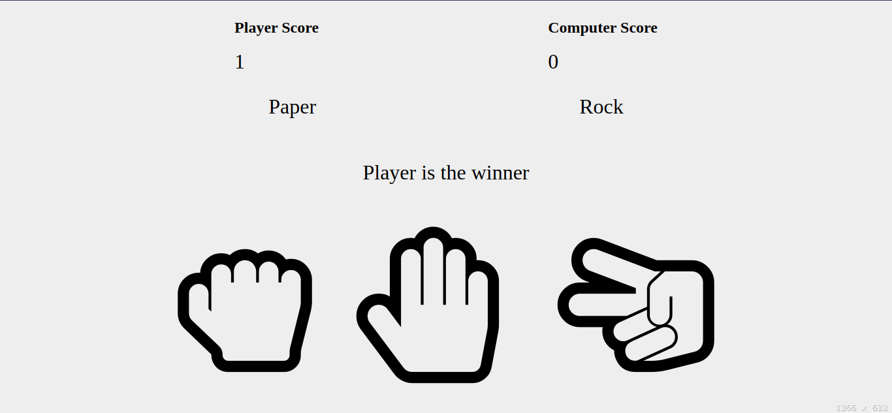

<h1 align="center"> rock-paper-scissors </h1>

<p align="center">
  <a href="https://github.com/ErickLuizA/rock-paper-scissors/graphs/commit-activity" alt="Maintenance">
    
  </a>

  <a href="https://rock-paper-scissors.netlify.app/" alt="rock-paper-scissors website">
    
  </a>

  <a href="./LICENSE" alt="License: MIT">
    
  </a>

<br/>


<a href="https://github.com/ErickLuizA/rock-paper-scissors/stargazers">
  
</a>

<p align="center">
  <a href="#clipboard-description">Description</a>&nbsp;&nbsp;&nbsp;|&nbsp;&nbsp;&nbsp;
  <a href="#building_construction-technologies">Technologies</a>&nbsp;&nbsp;&nbsp;|&nbsp;&nbsp;&nbsp;
  <a href="#rocket-getting-started">Getting Started</a>&nbsp;&nbsp;&nbsp;|&nbsp;&nbsp;&nbsp;
  <a href="#memo-license">License</a>&nbsp;&nbsp;&nbsp;|&nbsp;&nbsp;&nbsp;
  <a href="#framed_picture-screenshots">Screenshots</a>
</p>

## :clipboard: Description

A simple rock-paper-scissors game made with js

## :building_construction: Technologies

- HTML
- CSS
- JAVASCRIPT

## :rocket: Getting Started

1. Download the repository

```shell
 $ git clone https://github.com/ErickLuizA/rock-paper-scissors.git

 or

 $ gh repo clone ErickLuizA/rock-paper-scissors
```

2. Execution

```shell
  Open the index.html file in a browser
```

## :framed_picture: Screenshots

<div>
  
</div>

> [Live Demo](https://srock-paper-scissors.netlify.app/)

## :memo: License

This project is under the MIT license. See the file [LICENSE](LICENSE) for more details.

---

Build with 💙 By [Erick](https://www.linkedin.com/in/erick-luiz-47151a1a4/)
